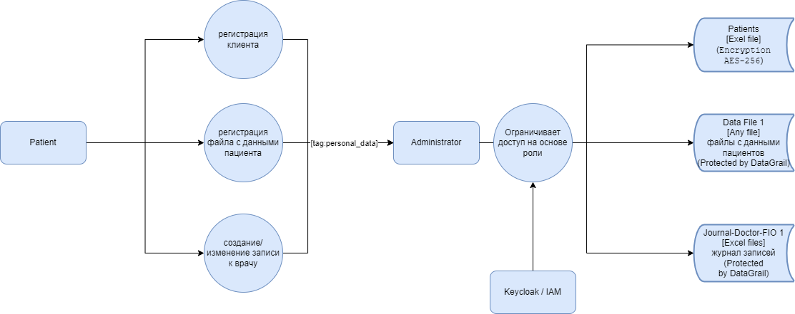
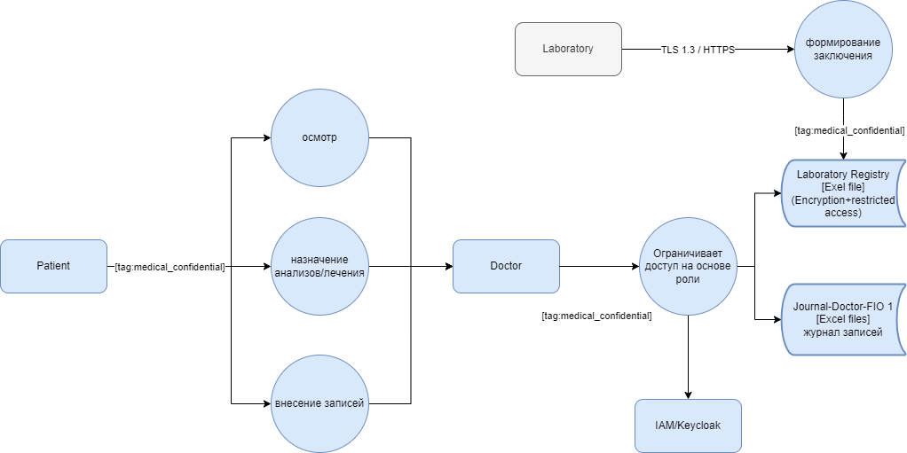
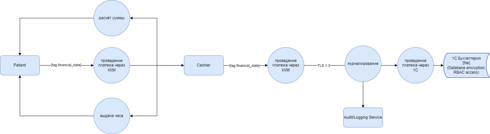
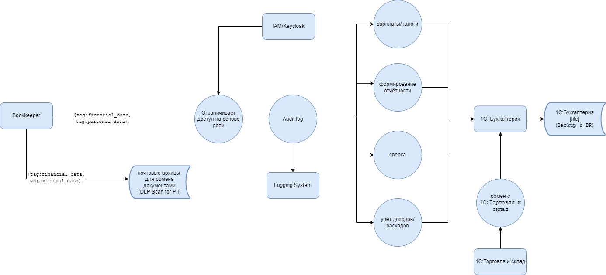
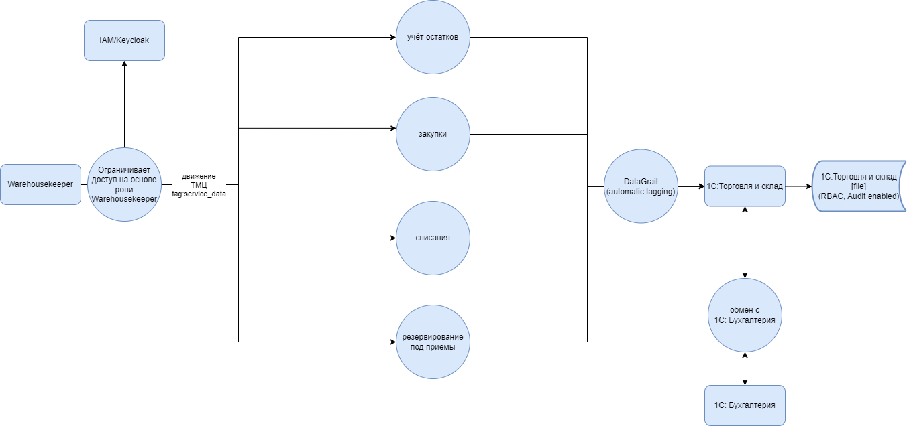

# Task 1. Data Flow Diagrams

В рамках первого задания проведен анализ текущего состояния компании и построены диаграммы потоков данных. Для каждого ключевого процесса подготовлена отдельная схема. Диаграммы показывают, какие данные используются, как они перемещаются по системам и какие действия с ними выполняют сотрудники.

---

## 1. Работа администратора и ресепшена

Диаграмма отражает процесс регистрации клиента, добавление файлов с персональными данными и создание записей к врачу. Данные сохраняются в Excel-файлах пациентов и журнале записей.

---

## 2. Работа врача

Схема показывает взаимодействие врача с пациентом и лабораторией. Врач осматривает пациента, назначает анализы и лечение, вносит записи в журналы. Результаты лаборатории фиксируются в отдельном реестре.

---

## 3. Работа кассира и пациента

На диаграмме показан расчет стоимости услуг, проведение платежа через ККМ и 1С, а также выдача чека пациенту. Данные о платежах фиксируются в бухгалтерии.

---

## 4. Работа бухгалтера

Диаграмма отражает учет доходов и расходов, сверку данных, формирование отчетности и расчет зарплат и налогов. Бухгалтер использует 1С и почтовые архивы для обмена документами.

---

## 5. Работа сотрудника склада

Схема показывает учет остатков, закупки, списания и резервирование материальных ценностей. Данные фиксируются в 1С:Торговля и склад и обмениваются с бухгалтерией.

---

# Аудит мер по безопасности данных

Ниже приведен список процессов компании и проблемные зоны, связанные с защитой данных пациентов. Анализ показал, что механизмы защиты практически отсутствуют: нет разграничения доступа (RBAC/ABAC), отсутствуют политики резервного копирования и восстановления, не используются шифрование и современные методы управления идентичностью. 

| Процесс | Проблемные зоны |
|---------|-----------------|
| Администратор и ресепшен | - Персональные данные пациентов хранятся в Excel и сканах без шифрования - Нет разграничения доступа к файлам (любой сотрудник может получить доступ) - Нет аудита операций с файлами - Отсутствуют механизмы Privacy by Design и минимизации данных |
| Врач | - Медицинские записи сохраняются в локальных файлах без защиты - Нет контроля доступа по ролям (врач может видеть все файлы) - Передача данных в лабораторию не защищена (нет HTTPS/TLS) - Нет отслеживания изменений и Data Lineage |
| Кассир и пациент | - Платежные данные пациента хранятся в Excel и 1С в файловом режиме - Нет защиты данных при передаче от кассы к 1С - Нет мониторинга операций с платежами - Дублирование учета повышает риск ошибок и утечек |
| Бухгалтер | - Данные о пациентах и платежах обрабатываются в 1С в файловом режиме без шифрования - Нет резервного копирования и disaster recovery плана - Нет разграничения доступа на уровне записей - Передача документов по почте без защиты (PII и финансы в письмах) |
| Склад | - Заявки врачей и информация о пациентах могут передаваться в 1С без защиты - Нет политики контроля доступа к данным о заказах - Нет шифрования файлов учета ТМЦ - Нет аудита взаимодействий с бухгалтерией |

## Итог

В компании отсутствуют базовые меры защиты:  
- нет RBAC/ABAC и принципа наименьших привилегий  
- нет шифрования данных при хранении и передаче  
- нет журналирования и аудита действий пользователей  
- нет резервного копирования и плана восстановления после сбоев  
- нет механизмов тегирования и категоризации данных (PII, медицинские, финансовые)  

Следующим шагом необходимо определить конкретные меры для устранения проблем: внедрение RBAC, переход на централизованное хранилище, использование шифрования и резервного копирования, а также реализация Privacy by Design, Data Minimization и Data Lineage.

---

# Улучшение защиты данных и внедрение тегирования

На этом этапе были определены категории данных для защиты, способы их защиты и предложен механизм тегирования данных. Также составлен список инструментов, которые помогут обеспечить конфиденциальность и соответствие требованиям законодательства.

## Категории данных и способы защиты

| Категория данных | Примеры | Методы защиты |
|------------------|---------|---------------|
| Персональные (PII) | ФИО, дата рождения, адрес, телефон, e-mail | Шифрование, токенизация, маскирование |
| Медицинские (PHI) | диагнозы, анализы, назначения, заключения | Шифрование, ограничение доступа RBAC/ABAC, тегирование «medical_confidential» |
| Финансовые | данные об оплатах, реквизиты счетов, суммы платежей | Шифрование, обфускация, DLP-инструменты для мониторинга |
| Документы | сканы паспортов, договоров | Шифрование файлов, обезличивание, хранение в защищенном репозитории |
| Служебные данные | данные о ТМЦ, закупках | Разграничение доступа по ролям, контроль изменений |

## Механизм тегирования

1. **Идентификация и классификация данных**  
   Использовать DLP-инструменты (Symantec DLP, McAfee DLP) и платформы Data Discovery (BigID, Informatica) для поиска персональных и медицинских данных.  

2. **Тегирование данных**  
   - Политика тегирования: персональные, медицинские, финансовые, служебные.  
   - Инструменты: DataGrail 
   - Автоматическая маркировка файлов и записей в хранилищах.  

3. **Контроль доступа по тегам**  
   - Использовать RBAC/ABAC в Keycloak или Azure AD.  
   - Доступ к данным определяется метками и ролями.  

4. **Мониторинг и аудит**  
   - BigID для контроля корректности тегов, для выявления неразмеченных или некорректно размеченных данных.  

1. **Обучение сотрудников**  
   - Обучение персонала правилам работы с тегированными данными.  
   - Разъяснение юридических обязательств и принципа Privacy by Design.  

2. **Поддержка и обновление**  
   - Автоматизация пересмотра тегов при изменении, архивировании или удалении данных.  
   - Регулярные проверки точности классификации.  

## Инструменты и меры

- Шифрование: AES-256, TLS 1.3 для передачи данных  
- Управление доступом: Keycloak или Azure AD (RBAC/ABAC)  
- Тегирование: DataGrail 
- DLP: Symantec DLP или McAfee DLP  
- Мониторинг: BigID
- Резервное копирование и disaster recovery: встроенные механизмы (Windows Server, Veeam Backup)  

---

# Улучшенные диаграммы потоков данных

На основе ранее созданных диаграмм были добавлены меры защиты данных, механизмы разграничения доступа и системы тегирования. Ниже представлены обновленные схемы с кратким описанием.

---

## 1. Работа администратора и ресепшена

На диаграмме показаны теги для персональных данных пациентов и внедрение системы управления доступом через Keycloak/IAM. Файлы пациентов и журналы защищены шифрованием и маркировкой с помощью DataGrail. Доступ к данным ограничен по ролям, что исключает возможность несанкционированного просмотра.

---

## 2. Работа врача

Здесь отмечены метки для медицинских данных пациентов. Передача информации в лабораторию осуществляется по защищенному каналу (TLS 1.3/HTTPS). Доступ к журналам и реестрам ограничен по ролям через Keycloak. Добавлено шифрование файлов и контроль доступа к медицинским записям.

---

## 3. Работа кассира и пациента

Диаграмма отражает защиту финансовых данных. Добавлен тег `financial_data`, передача данных в 1С выполняется через TLS 1.3. База 1С дополнена шифрованием и разграничением доступа (RBAC). Для операций с платежами введено обязательное журналирование и аудит.

---

## 4. Работа бухгалтера

На схеме показано использование тегов для финансовых и персональных данных. Обмен документами через почтовые архивы проходит с проверкой DLP. Доступ к системе ограничивается через Keycloak/IAM, а все действия фиксируются в журналах аудита. Для файлов бухгалтерии реализовано резервное копирование и план восстановления (Backup & DR).

---

## 5. Работа сотрудника склада

Диаграмма показывает обработку служебных и персональных данных. Доступ к функциям склада ограничен ролью в Keycloak. Для автоматической маркировки данных используется DataGrail. В 1С внедрены RBAC, аудит действий и контроль за изменениями данных.

---

## Список улучшений

В ходе доработки процессов были внедрены следующие меры защиты данных:

- **Общие меры**
  - Внедрение системы управления доступом (Keycloak/IAM) с разграничением прав по ролям (RBAC/ABAC).
  - Использование шифрования данных при хранении (AES-256) и передаче (TLS 1.3/HTTPS).
  - Введение тегирования данных (DataGrail) для автоматической классификации.
  - Настройка журналирования и аудита операций (Audit Log, Logging System).
  - Резервное копирование и disaster recovery (Veeam Backup).

- **Администратор/Ресепшен**
  - Метки `personal_data` для файлов и журналов пациентов.
  - Защита Excel-файлов шифрованием и маркировкой.
  - Ограничение доступа к данным только для администратора и врача.

- **Врач**
  - Метки `medical_confidential` для медицинских данных.
  - TLS 1.3 при передаче данных в лабораторию.
  - Шифрование медицинских журналов и реестров.
  - Контроль доступа через Keycloak.

- **Кассир и пациент**
  - Метки `financial_data` для платежей.
  - TLS 1.3 при передаче данных в 1С.
  - Шифрование базы 1С и ограничение доступа по ролям.
  - Введение обязательного журналирования всех транзакций.

- **Бухгалтер**
  - Метки `financial_data` и `personal_data`.
  - DLP-проверка почтовых архивов на наличие PII.
  - Контроль доступа через IAM и аудит действий.
  - Резервное копирование и план восстановления (Backup & DR).

- **Склад**
  - Метки `service_data` и `personal_data` (для заявок).
  - Роль Warehousekeeper в IAM для ограничения доступа.
  - Автоматическое тегирование данных через DataGrail.
  - В 1С включены RBAC, аудит и контроль изменений.

---

## Итог

В обновленных диаграммах отражены основные меры защиты:  
- шифрование и безопасная передача данных  
- разграничение доступа по ролям через IAM  
- маркировка и классификация данных с помощью DataGrail
- аудит и журналирование операций  
- резервное копирование и disaster recovery  

Эти меры позволяют снизить риски утечки данных и обеспечить соответствие требованиям безопасности.