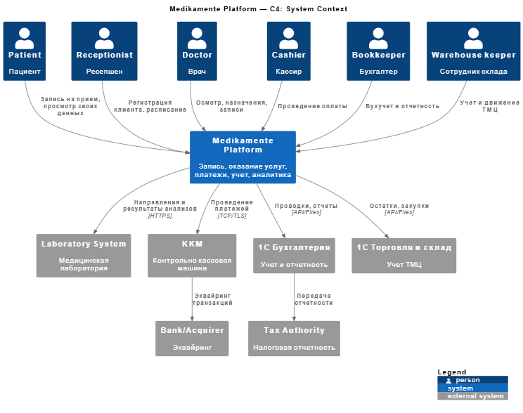
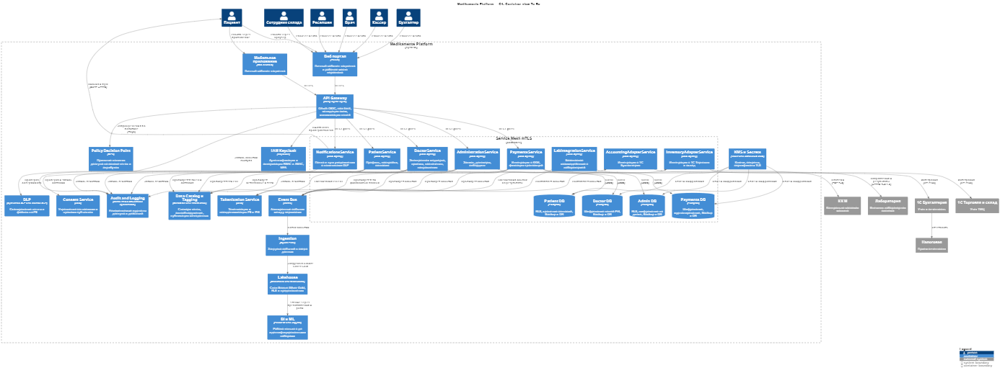

# Целевая архитектура системы Medikamente (To-Be)

---

Документ описывает целевую архитектуру с учетом Privacy by Design, управления рисками конфиденциальности и требований к аналитике. Стиль C4: сначала контекст, затем контейнеры и кросс-сервисные слои.

---

## 1. Цели To-Be
- Централизованная аутентификация и авторизация, минимально необходимый доступ.
- Сквозная защита данных при передаче и хранении, управление ключами.
- Классификация и тегирование данных, автоматическое обнаружение чувствительных данных.
- Прозрачный аудит действий, неизменяемые логи.
- Безопасная аналитика и ML на де-идентифицированных данных.
- Управление согласиями и правами субъектов данных.
---

## 2. C4 System Context
Акторы: Пациент, Ресепшен, Врач, Кассир, Бухгалтер, Сотрудник склада, Лаборатория, Банк или Эквайер, Налоговый орган.  
Система: Medikamente Platform для записи, оказания услуг, платежей, учета и аналитики.

---

## 3. C4 Container View

### 3.1 Бизнес-сервисы
- AdministrationService  
  Функции: запись, договоры, онбординг. База: Postgres с RLS.
- DoctorService  
  Функции: электронная медкарта, приемы, назначения, направление в лабораторию. База: Postgres, шифрование на уровне поля для PHI.
- PatientService  
  Функции: профиль пациента, настройки, согласия. База: Postgres.
- PaymentsService  
  Функции: интеграция с ККМ, создание и фиксация транзакций. База: Postgres.
- AccountingAdapterService  
  Интеграция с 1С: Бухгалтерия. Асинхронное взаимодействие через шину событий.
- InventoryAdapterService  
  Интеграция с 1С: Торговля и склад. Асинхронное взаимодействие через шину событий.
- LabIntegrationService  
  Безопасный API к лаборатории, минимизация полей, подпись и шифрование полезной нагрузки.
- NotificationsService  
  Почта и пуш-уведомления с политиками DLP.

### 3.2 Слой безопасности и управления данными
- API Gateway  
  Входная точка для веб и мобильного приложения. OAuth 2.0 и OpenID Connect, квоты, валидация схем, фильтры минимизации данных на границе.
- Identity and Access Management  
  Keycloak или Azure AD. RBAC и ABAC, MFA для персонала, политики сессий.
- Policy Decision and Enforcement  
  OPA или аналог. Политики используют теги и атрибуты. Применяются на шлюзе и в сайдкарах.
- Data Tagging and Catalog  
  DataGrail как основной инструмент тегирования. Дополнительно Informatica Data Catalog. Словари тегов, публикация тегов для PDP.
- Consent and Data Subject Rights  
  Сервис согласий и прав субъектов. Хранение версии согласий, проверка при доступе, оркестрация DSAR на удаление и экспорт.
- Tokenization and Pseudonymization  
  Сервис токенизации PII и PHI. Реидентификация по процедуре break-glass и с одобрением.
- Key Management and Secrets  
  Vault или облачный KMS. Оболочечное шифрование, выпуск сертификатов TLS, секреты БД и ККМ.
- Audit and Logging  
  Неизменяемый аудит. Топики Kafka только на добавление и WORM-хранилище. Корреляция запросов, события доступа к данным.
- Data Loss Prevention  
  DLP для почты и файлов. Сканирование и блокировка утечек размеченного контента.
- Service Mesh  
  Istio или Linkerd. Взаимное TLS, политики трафика, ограничение бокового движения.
- Backup and Disaster Recovery  
  Точечное восстановление по времени для каждой БД. План восстановления и регулярные тесты.

---

## 4. Платформа аналитики
- Ingestion и управление качеством  
  Поставка событий в озеро данных через шину. Слои Bronze Silver Gold. За пределами Bronze допускаются только де-идентифицированные данные. OpenLineage или Marquez для происхождения. Наследование тегов из операционных систем.
- Хранилище  
  Warehouse или Lakehouse, например Snowflake или ClickHouse. Политики безопасности на уровне строк и представлений, доступ через роли и теги.
- BI и ML  
  Песочницы только с токенизированными или агрегированными наборами. Краткоживущие креды от IAM. Доступ только на чтение.

---

## 5. Privacy by Design в реализации
- Минимизация  
  Фильтры в API Gateway удаляют неиспользуемые поля. LabIntegrationService отправляет код теста и токен вместо полного профиля.
- Ограничение цели обработки  
  Политики PDP требуют атрибут purpose. Сервисы объявляют цель для чтения тегированных данных.
- Сквозная безопасность  
  TLS 1.3 снаружи, mTLS между сервисами. Шифрование дисков и полей для PHI.
- Прозрачность  
  Портал пациента показывает состав хранимых данных, теги и согласия. DSAR реализован как самообслуживание.
- Жизненный цикл  
  Политики хранения на уровне сервиса. Автоудаление или архивирование по меткам и согласиям.

---

## 6. Матрица риск — контроль
| Риск | Контроль | Блоки |
|------|----------|-------|
| Чрезмерный доступ персонала к медкартам | ABAC по роли, отделу, контексту и цели | IAM Keycloak, OPA PDP, сайдкары mesh |
| Утечка через почту и вложения | DLP для почты и файлов | DLP, NotificationsService |
| PHI без шифрования в хранилищах | Шифрование на уровне поля и диска | DoctorService DB, Vault или KMS |
| Боковое движение внутри сети | mTLS и Zero Trust | Service Mesh, API Gateway |
| Недостаточный аудит | Неизменяемый аудит и WORM | Audit and Logging, Kafka, объектное хранилище |
| Избыточные данные внешним партнерам | Минимизация и токенизация на границе | API Gateway, Tokenization Service, LabIntegrationService |
| Несогласованные теги | Автообнаружение и каталог | DataGrail, Data Catalog, Lineage |
| Некорректная аналитика с PII | Де-идентификация и защищенное хранилище | Ingestion, Lakehouse, RLS и представления |

---

## 7. Границы сервисов и владение данными
- AdministrationService владеет записью и онбордингом.
- PatientService владеет профилем и согласиями.
- DoctorService владеет EMR и PHI.
- PaymentsService владеет транзакциями и не хранит сырые платежные реквизиты.
- AccountingAdapterService и InventoryAdapterService владеют состоянием интеграции и маппингами.
- LabIntegrationService владеет связями направлений и токенизированными результатами.

---

## 8. Минимальный план миграции
1. Ввести API Gateway и IAM. Включить базовый RBAC.
2. Подключить Audit и Data Catalog. Начать тегирование в файловых хранилищах через DataGrail.
3. Выделить PatientService и сервис согласий. Перенести расписание в AdministrationService.
4. Внедрить PaymentsService и адаптер к 1С бухгалтерии. Интегрировать ККМ.
5. Развернуть DoctorService и LabIntegrationService с токенизацией и шифрованием полей.
6. Добавить Service Mesh и включить mTLS.
7. Построить конвейер загрузки и слой аналитики с де-идентификацией.
