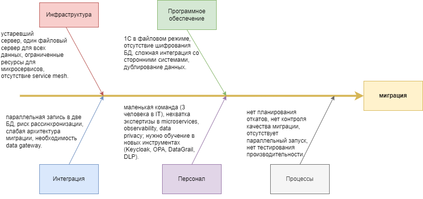

# Task 4. Оценка узких мест при миграции

В рамках задания проведен анализ потенциальных узких мест при переходе компании от монолитной системы к микросервисной архитектуре. Для выявления причин был использован метод диаграммы Исикавы.

## Диаграмма Исикавы

Диаграмма показывает основные категории проблем, которые могут повлиять на успешность миграции: инфраструктура, программное обеспечение, интеграция, персонал и процессы.

## Выявленные проблемы

### Инфраструктура
- устаревший сервер и один файловый сервер для всех данных  
- ограниченные ресурсы для запуска микросервисов  
- отсутствие service mesh  

### Программное обеспечение
- использование 1С в файловом режиме  
- отсутствие встроенного шифрования баз данных  
- сложная интеграция со сторонними системами  
- дублирование данных  

### Интеграция
- параллельная запись в две базы данных  
- риск рассинхронизации и потери целостности данных  
- слабая архитектура миграции и необходимость data gateway  

### Персонал
- маленькая команда (3 человека в IT)  
- нехватка экспертизы в microservices, observability и data privacy  
- необходимость обучения новым инструментам (Keycloak, OPA, DataGrail, DLP)  

### Процессы
- отсутствие планирования откатов  
- отсутствие контроля качества миграции  
- нет параллельного запуска для проверки корректности  
- нет тестирования производительности  

## Рекомендации

1. Обеспечить обучение команды и расширение штата за счет кросс-функциональных групп. В каждой команде должны быть компетенции как по бизнес-логике, так и по инфраструктуре.  
2. Внедрить централизованное мониторинг и логирование, использовать решения для трассировки и алертинга.  
3. Использовать Data Gateway или Proxy для управления параллельной записью и обеспечения согласованности данных при миграции.  
4. Применить паттерны Parallel Run и Branch by Abstraction для снижения рисков и постепенного перевода нагрузки.  
5. Разработать четкий план отката на каждом этапе перехода, включая механизмы синхронизации и возврата данных.  
6. Внедрить тестирование производительности и регрессионное тестирование до полного переключения трафика.  

## Приоритетность мер

1. Обучение и усиление команды, формирование кросс-функциональных групп  
2. Внедрение систем мониторинга, алертинга и централизованного логирования  
3. Реализация Data Gateway и стратегия Parallel Run для параллельного запуска  
4. Внедрение RBAC и Data Privacy tagging в новых сервисах  
5. Планирование отката и регулярные проверки на каждом этапе миграции  

## Итог

Основные риски связаны с ограниченными ресурсами инфраструктуры, нехваткой экспертизы в команде, отсутствием зрелых процессов мониторинга и отката, а также с необходимостью согласованности данных при параллельной работе старой и новой систем. Реализация предложенных мер позволит снизить риски, обеспечить прозрачность миграции и повысить устойчивость нового решения.
